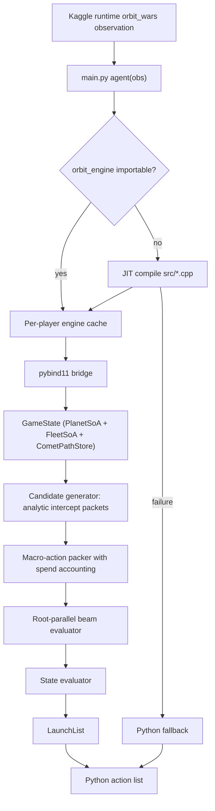
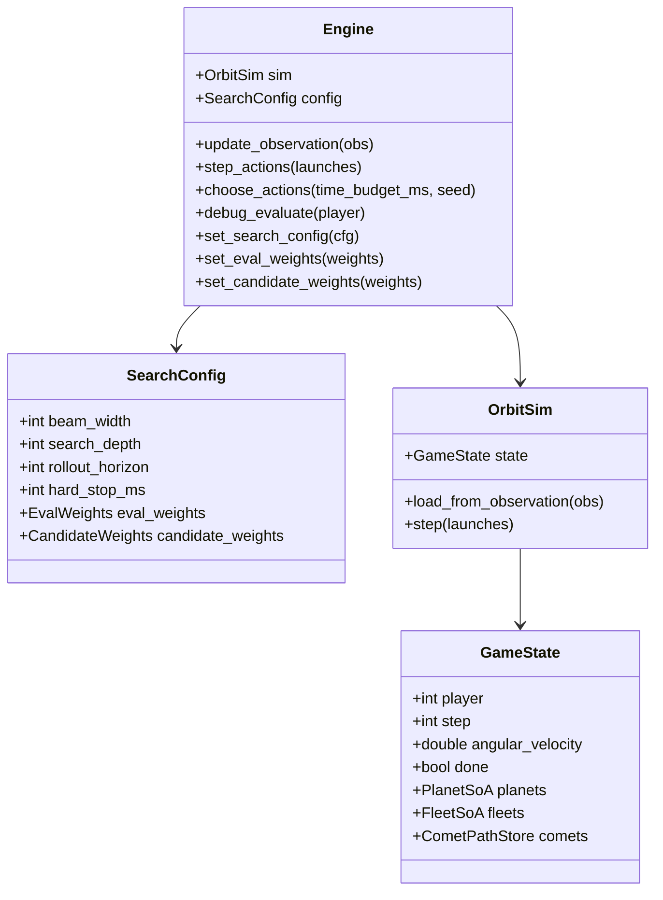
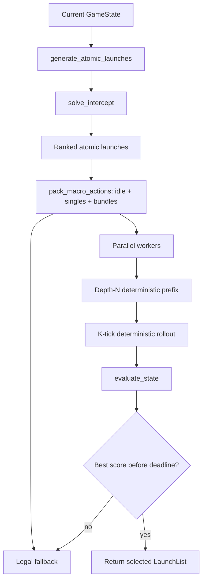

# Architecture

This document describes the Orbit Wars native engine: its layers, data flow, search loop, data model, algorithmic foundation, and the Python API. It is written against the current implementation and is the reference for how the pieces fit together.

## Overview

The system is split along ownership boundaries. Python owns the Kaggle lifecycle, native import and JIT compilation, fallback behavior, and packaging. C++ owns every latency-sensitive decision path: observation ingestion, geometry, simulation, candidate generation, search, and action serialization.

The engine treats Orbit Wars as a continuous tactical search problem. It predicts moving planets and comets, solves interception geometry for candidate launches, packs those launches into legal macro-actions, and evaluates each macro through deterministic rollouts. The action frontier is ranked before search, so the search itself is a bounded 1-ply evaluation of analytically solved packets rather than brute-force angle sampling.

## System Layers

| Layer | Implementation | Responsibility |
| --- | --- | --- |
| Kaggle entrypoint | `main.py` | Persistent per-player engines, native import or JIT build, champion routing by player count |
| Python/C++ bridge | `src/orbit_engine_bindings.cpp` | Observation conversion, hyperparameter injection |
| State reconstruction | `src/orbit_engine_state.cpp` | Observation ingestion, orbital and comet metadata |
| Simulator | `src/orbit_engine_sim.cpp` | Turn order, launches, production, movement, combat, termination |
| Geometry | `src/orbit_engine_geometry.cpp` | Fleet speed, collision, swept tests, interception solving |
| Candidate generation | `src/orbit_engine_candidate.cpp` | Atomic launch packets, macro-action packing |
| Search | `src/orbit_engine_search.cpp` | Root-parallel macro-action evaluation and rollouts |
| Evaluator | `src/orbit_engine_eval.cpp` | Dense heuristic with weight-aware terms |
| Facade | `src/orbit_engine_engine.cpp` | Wires simulator, config, and search for one player |

Headers live in `src/include/` under `orbit_engine.hpp` (umbrella), `constants.hpp`, `observation.hpp`, `board.hpp`, `config.hpp`, `engine.hpp`, `candidate.hpp`, `eval.hpp`, `geometry.hpp`, `search.hpp`, and `orbit_engine_internal.hpp`.

## Data Flow



## Native State Model

The game state is structured for predictable memory access and fast copying during search. The hot path uses Structure-of-Arrays storage.



Key fixed capacities from `src/include/constants.hpp`:

| Constant | Value | Purpose |
| --- | ---: | --- |
| `MAX_PLAYERS` | 4 | Two- or four-player games |
| `MAX_PLANETS` | 96 | Static planets plus active comets |
| `MAX_FLEETS` | 4096 | Active fleets in simulation and rollouts |
| `MAX_ATOMIC_LAUNCHES` | 1536 | Ranked launch candidates |
| `MAX_MACRO_ACTIONS` | 512 | Packed action candidates |
| `MAX_BEAM_WIDTH` | 512 | Hard cap on evaluated root candidates |
| `MAX_LAUNCHES` | 128 | Output launches per turn |
| `MAX_SEARCH_THREADS` | 20 | Root evaluation worker cap |
| `EPISODE_STEPS` | 500 | Episode length; the last agent call is step 498 |

## Search Loop

The search builds a legal action frontier first, then evaluates it. It generates candidate packets from owned planets to every live non-owned target, ranks them by tactical value, packs high-scoring combinations without overspending a source, and evaluates the resulting macro-actions in parallel.



### Candidate Evaluation

Each candidate macro is evaluated by copying the root state, applying the macro for the controlled player, filling opponent actions with the same deterministic policy, and rolling the state forward through a tactical prefix and a rollout horizon. The rollout is deterministic so branch scores are reproducible across worker threads.

### Deadline Handling

The search clamps the budget to the native hard stop, checks the deadline periodically per worker, and preempts rollouts internally when the deadline is near. Worst-case overshoot stays under one candidate evaluation, which protects the Kaggle per-turn budget.

## Algorithmic Foundation

### Fleet Speed

Fleet speed scales logarithmically with packet size:

```math
\begin{aligned}
v(n) =\;&
\min\left(
v_{\max},
\max\left(
1,\;
1 + (v_{\max} - 1)
\left(\frac{\log(\max(n, 1))}{\log(1000)}\right)^{1.5}
\right)
\right)
\end{aligned}
```

### Moving-Target Interception

For each source planet, target, and packet size, the engine solves for the arrival time `tau` such that the fleet reaches the target:

```math
f(\tau) =
\left\|p_i(\tau) - s\right\| - v(n)\tau = 0
```

Static targets use the closed form `tau = max(1, dist / speed)`. Orbiting planets are predicted from the observed phase, orbit radius, and angular velocity. Comets are predicted by interpolating their observed path samples. Moving targets solve the equation with secant-assisted bisection over `tau in [1, 120]`, and comets whose path ends before `tau` are rejected.

### Continuous Collision Detection

Fleet movement is modeled as a segment each tick. Collisions use the same relative swept-pair test as the environment, which solves the quadratic of relative motion between a moving fleet and a moving planet:

```math
\left\| (A - P_0) + t\left[(B - A) - (P_1 - P_0)\right] \right\|^2 = R^2, \qquad 0 \le t \le 1
```

where `A` and `B` are the fleet positions at tick start and end, `P_0` and `P_1` are the planet positions at tick start and end, and `R` is the planet radius. The environment precedence is preserved: planets are tested first, then board bounds, then the sun. This means a fleet that crosses a planet and the sun in one tick is credited to the planet.

### Candidate Generation

For every owned source and every live non-owned target, the engine emits a tactical basis:

- `CaptureExact`: enough ships to capture on arrival, including production during travel.
- `CaptureOver`: capture ships plus production-based slack.
- `Harass`: a low-commitment probe.
- `AllSafe`: all ships above a defensive reserve.

Defensive `Reinforce` packets are generated first for owned planets under incoming threat. Atomic priority rewards production and enemy or comet targets, then discounts slow arrivals and expensive launches.

### Deterministic Rollout Evaluation

The evaluator balances material, production, territory, threat, and comet opportunities. It also includes a projected-garrison timeline term, which rolls each owned planet's garrison forward a fixed horizon so ownership flips are visible to the value:

```math
\begin{aligned}
E(s,p) =\;&
w_{\text{ship}}(S_p - S_{\neg p})
+ w_{\text{production}}(P_p - P_{\neg p}) \\
&+ w_{\text{territory\_own}}\,T_p
- w_{\text{territory\_opp}}\,T_{\neg p}
- w_{\text{threat}}\,H_p \\
&+ w_{\text{comet\_owned}}\,C^{\text{own}}
- w_{\text{comet\_enemy}}\,C^{\text{enemy}}
+ w_{\text{comet\_neutral}}\,C^{\text{neutral}} \\
&+ w_{\text{timeline}}
\left(\sum_{\text{owned}} (G_i + q_i \cdot H) - \sum_{\text{opponent}} (G_i + q_i \cdot H)\right)
\end{aligned}
```

where `C_own` is `18.0 + 0.35` per ship on an owned comet, `C_enemy` is `12.0 + 0.2` per ship on an enemy comet, `C_neutral` is `max(0, 10.0 - 0.1)` per ship on a neutral comet, and `H` is the timeline horizon. The tunable weights live in `config/hyperparameters.json`.

## Simulation Fidelity

`OrbitSim::step()` follows the competition turn order:

1. Expire comets whose path has ended.
2. Process legal launches and reject overspending.
3. Produce ships on owned planets and comets.
4. Compute each planet's tick-end position up front.
5. Move fleets with continuous swept-pair collision checks.
6. Apply planet positions and remove expired comets.
7. Resolve queued planet combats.
8. Advance the step counter and mark terminal states.

The terminal boundary is `EPISODE_STEPS - 1` on the stored step, matching the environment's last agent call at step 498.

## Python API

The pybind module exposes a compact API:

```python
import orbit_engine

engine = orbit_engine.Engine(player=0)
engine.update_observation(obs)
actions = engine.choose_actions(time_budget_ms=900, seed=123)
```

Hyperparameters are injected in one call:

```python
engine.set_hyperparameters(
    beam_width=384,
    search_depth=8,
    rollout_horizon=64,
    ship=1.0,
    production=25.0,
    timeline=0.02,
    owner_enemy=42.0,
    kind_reinforce=6.0,
)
```

The engine also exposes `debug_state()`, `debug_evaluate(player)`, and `set_search_thread_limit(n)`.

## Threading and Performance

- Root-parallel evaluation: workers consume an atomic candidate cursor and write disjoint score slots.
- Each worker mutates an independent `GameState` copy, so there is no shared mutable state.
- The hot path is allocation-free; only thread creation and the output conversion touch the heap.
- The per-process worker cap is clamped to `MAX_SEARCH_THREADS`, and tuning forces it to one per worker to avoid oversubscription.

## Environment Rules Fidelity

The simulator is calibrated against the Kaggle interpreter:

- Collision precedence is planets, then board bounds, then the sun.
- Planet motion is linearised to a chord for the swept-pair test, matching the environment.
- Fleets spawn just outside the source radius with the environment offset.
- The episode ends after turn 498.
- Active comet paths are modeled from the observation; future comet spawns are not fabricated.

`scripts/diffcheck.py` and `tests/test_differential.py` lock these behaviors.
