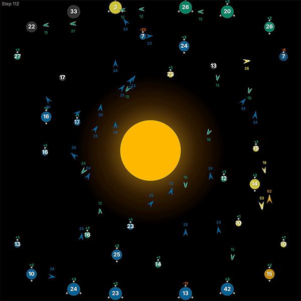
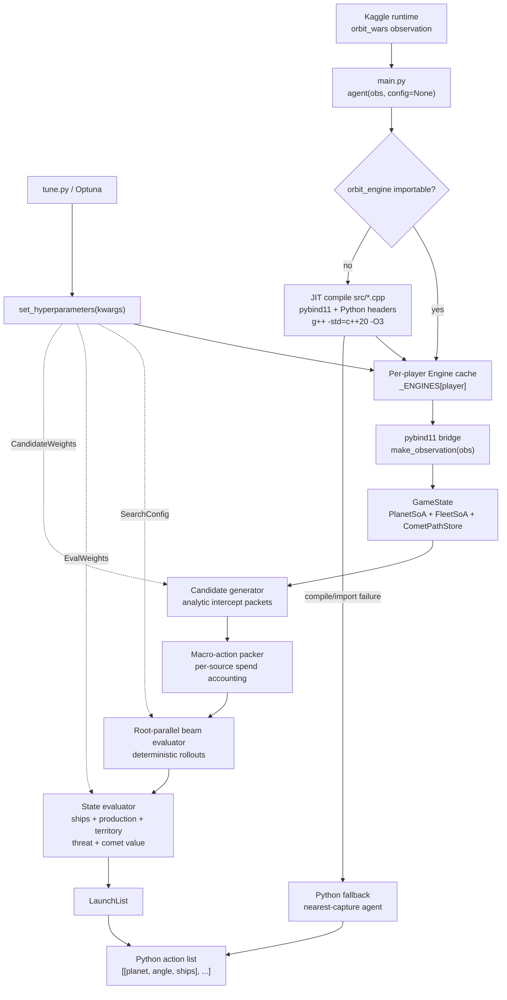
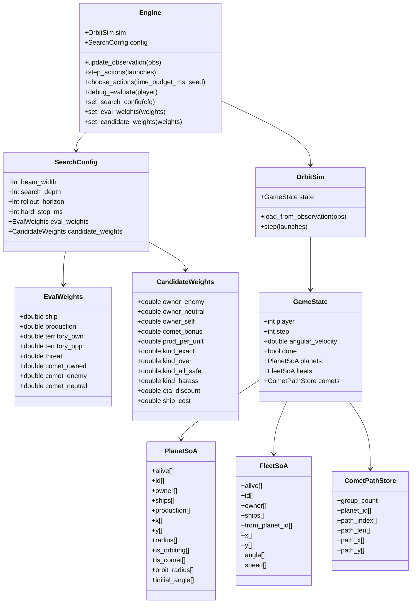
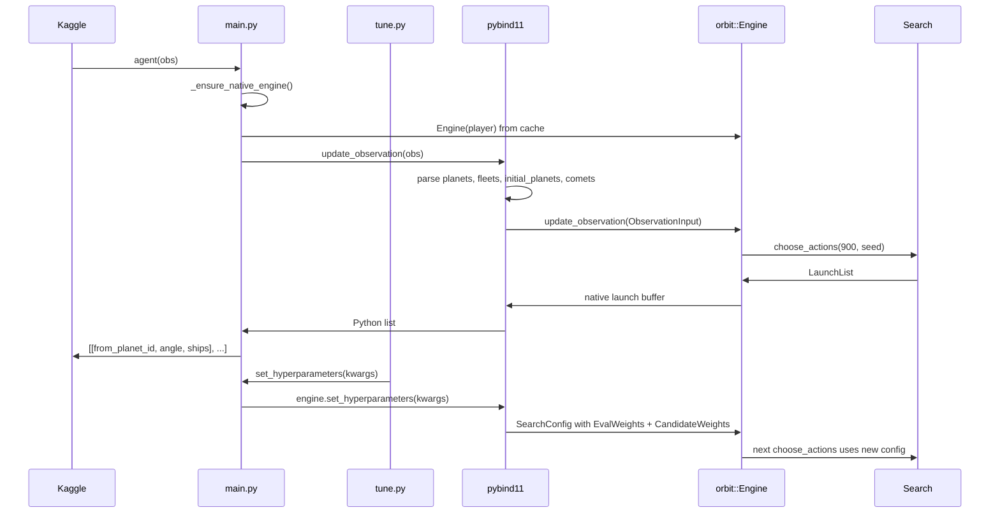
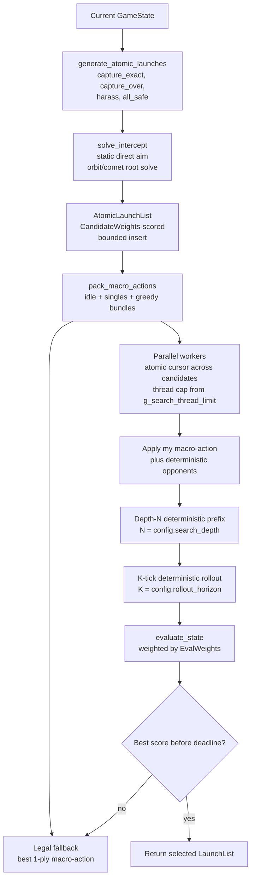

# Orbit Wars Beam Search Engine

### Fixed-buffer Beam Search agent for Kaggle Orbit Wars.

This repository is a high-performance C++20 agent for [Kaggle's Orbit Wars Competition](https://www.kaggle.com/competitions/orbit-wars). The solution treats Orbit Wars as a continuous 2D tactical search problem: it predicts moving planets and comets, solves interception geometry for candidate launches, packs those launches into legal multi-order macro-actions, and evaluates them through a fixed-buffer simulator exposed to Kaggle through a small Python entrypoint.

The core breakthrough is not brute-force angle sampling. The engine shrinks the search space before search begins by converting the game into a ranked set of analytically solved tactical packets: exact captures, over-captures, harassment probes, and all-safe launches. Those packets are then combined under per-source spend constraints and scored by root-parallel deterministic rollouts. In practice, the Python layer is intentionally thin; the game model, geometry, combat resolution, candidate generation, and action selection all live in native code.

<p align="center">
    
</p>

### Engineering Highlights

- **Native search core:** `orbit_engine` is a C++20 pybind11 extension compiled with `-O3`, `-march=native`, `-ffast-math`, and `-pthread`.
- **Fixed-buffer state model:** planets, fleets, comet paths, combat queues, launch lists, atomic actions, and macro-actions use bounded `std::array` storage with explicit capacities.
- **Continuous physics simulator:** fleet segments are checked against the sun, board boundaries, planets, moving orbit arcs, and comet path sweeps instead of relying on endpoint approximations.
- **Analytic interception:** static targets use direct headings; orbiting planets and comets solve a bounded time-of-arrival equation over $`\tau \in [1, 120]`$.
- **Beam-style root evaluator:** the engine evaluates up to 384 packed macro-actions by default, rolls each forward through deterministic opponent policies, and selects the best state-evaluated branch within the 900 ms Kaggle action budget.
- **Runtime hyperparameter injection:** `set_hyperparameters(kwargs)` retunes search depth, candidate prior weights, and evaluator weights through the pybind11 bridge in a single call; defaults reproduce the original hand-tuned values bit-for-bit.
- **Optuna tuning harness:** `tune.py` runs a multi-process Bayesian-Optimization study over all 22 exposed hyperparameters. By utilizing a `ProcessPoolExecutor` and Optuna's Ask-and-Tell API, the harness bypasses the Python GIL, enabling full multi-core scaling while persisting trials to SQLite.
- **Kaggle-safe deployment:** `main.py` imports a prebuilt extension when available and can JIT-compile the extension inside the submission bundle using vendored pybind11 headers.

## Competition Overview

Orbit Wars is a real-time strategy game played in a continuous 100 x 100 board. A sun sits at `(50, 50)` with radius `10`; fleets crossing it are destroyed. Each player begins with a home planet and wins by maximizing final ship count, including ships stationed on planets and ships in flight, over a 500-turn episode or by eliminating all other active players.

The board is generated with four-fold mirror symmetry around the center: `(x, y)`, `(100-x, y)`, `(x, 100-y)`, and `(100-x, 100-y)`. Maps contain 20 to 40 planets, organized as symmetric groups of four. In two-player games, starting planets are placed on opposite diagonals; in four-player games, each player receives one planet from the same symmetric home group.

Planets are represented as:

```text
[id, owner, x, y, radius, ships, production]
```

The owner is a player id from `0` to `3`, or `-1` for neutral. Owned planets generate `production` ships each turn. Planet radius is tied to production by the competition rule `1 + ln(production)`, so high-production planets are both more valuable and larger collision targets. Inner planets rotate around the sun when their orbit plus radius fits within the rotation limit; outer planets remain static. The observation's `initial_planets` and `angular_velocity` fields make those future positions predictable.

Fleets are represented as:

```text
[id, owner, x, y, angle, from_planet_id, ships]
```

Fleet speed scales logarithmically with packet size, from `1.0` for one-ship probes toward the configured maximum of `6.0`. Launches spawn just outside the source planet radius in the chosen direction, and the simulator checks the full path segment for sun hits, board exits, and planet collisions.

Actions are lists of launches:

```python
[[from_planet_id, angle_radians, ships], ...]
```

Launches can only spend ships currently available on owned planets. Each turn expires comets, processes launches, produces ships, moves fleets, advances planets and comets, and then resolves combat.

Comets are temporary capturable planets that arrive in mirrored groups of four at steps `50`, `150`, `250`, `350`, and `450`. They have radius `1.0`, produce one ship per turn while owned, follow precomputed high-speed paths through the board, and are removed with their garrison when they leave the map.

Combat groups all arriving fleets by owner. The largest arriving force fights the second largest; if exactly one attacking owner survives, that survivor either reinforces an owned planet or fights the planet garrison to capture it.

## Repository Map

| Path | Role |
| --- | --- |
| `main.py` | Kaggle entrypoint, native import/JIT compilation, Python fallback agent, runtime hyperparameter injection |
| `submission.py` | Local alias exporting `agent` from `main.py` |
| `tune.py` | Optuna-based multi-process tuning harness with Ask-and-Tell orchestration and SQLite storage |
| `opponents/` | Drop-in opponent policies (`baseline.py`, `greedy.py`, `mirror.py`) sampled by the tuning harness |
| `src/orbit_engine.hpp` | Public engine facade, `EvalWeights`/`CandidateWeights`/`SearchConfig` structs, fixed capacities, SoA buffers |
| `src/orbit_engine_state.cpp` | Observation ingestion, orbit/comet metadata, state reconstruction |
| `src/orbit_engine_sim.cpp` | Turn-order simulator, launches, production, movement, combat, termination |
| `src/orbit_engine_geometry.cpp` | Fleet speed, collision geometry, swept tests, interception solving |
| `src/orbit_engine_candidate.cpp` | Atomic launch generation, legal macro-action packing, weight-aware candidate scoring |
| `src/orbit_engine_search.cpp` | Root-parallel macro-action evaluation, deterministic rollouts, runtime thread cap |
| `src/orbit_engine_eval.cpp` | Dense heuristic evaluator with weight-aware term scaling |
| `src/orbit_engine_bindings.cpp` | pybind11 conversion layer, `Engine` Python API, `set_hyperparameters(kwargs)` interface |
| `test.py` | Regression tests for physics, parsing, search legality, packaging, Kaggle smoke, hyperparameters, opponents |
| `package_submission.py` | Builds `submission.tar.gz` with sources and vendored pybind11 headers |
| `CMakeLists.txt` | C++20 pybind11 build definition |
| `.github/workflows/ci.yml` | Python 3.11/3.12 build, test, Optuna smoke, package, and release artifact workflow |
| `rules/` | Local copy of Orbit Wars rules, getting-started material, and baseline example |

## System Architecture

The architecture is intentionally split between a tiny Python surface and a native engine that owns the expensive work. The Python entrypoint is responsible for Kaggle compatibility, extension discovery, optional JIT compilation, and persistent per-player engine instances. Once an observation reaches C++, it is converted into fixed buffers and never leaves native code until a final action list is returned.



### Native State Model

The game state is structured for predictable memory access and fast copying during search. The hot path uses Structure-of-Arrays storage rather than object-heavy per-entity allocations.



Key fixed capacities from `src/orbit_engine.hpp`:

| Constant | Value | Purpose |
| --- | ---: | --- |
| `MAX_PLAYERS` | 4 | Two- or four-player Orbit Wars games |
| `MAX_PLANETS` | 96 | Static planets plus active comets |
| `MAX_FLEETS` | 4096 | Active fleets in simulation and rollouts |
| `MAX_COMET_GROUPS` | 8 | Stored comet groups |
| `MAX_COMET_PATH_POINTS` | 512 | Path samples per comet |
| `MAX_ATOMIC_LAUNCHES` | 1536 | Ranked launch candidates |
| `MAX_MACRO_ACTIONS` | 512 | Packed action candidates |
| `MAX_BEAM_WIDTH` | 512 | Hard cap on evaluated root candidates |
| `MAX_LAUNCHES` | 128 | Output launches per turn |
| `MAX_SEARCH_THREADS` | 20 | Root evaluation worker cap |

The regression suite explicitly checks the hot source files for dynamic-allocation primitives such as `std::vector`, `std::set`, `make_unique`, `make_shared`, `std::function`, and `std::async`.

### Python to C++ Bridge

The binding layer accepts both dictionary-style Kaggle observations and attribute-style namespace observations. It converts Python lists into `ObservationInput`, clamps counts to fixed capacities, reconstructs initial planet metadata, and exposes a small API for tests and local experimentation. The `set_hyperparameters(kwargs)` route is the inverse: a `py::kwargs` dict is parsed into the native `SearchConfig` (with `EvalWeights` and `CandidateWeights` nested structs) and the engine is reseated in one call.



### Search Loop

The search loop is built around a legal action frontier. It first generates candidate launch packets from owned planets to every non-owned live target, sorts them by tactical value, packs high-scoring combinations without overspending a source planet, then evaluates the resulting macro-actions in parallel. The candidate prior and the dense rollout heuristic consume the same `SearchConfig` so a single `set_hyperparameters(kwargs)` call from Python retunes both the frontier ranking and the rollout scoring in one shot.



## Algorithmic and Mathematical Foundation

### Fleet Speed

Orbit Wars makes large fleets faster. The engine mirrors the rule formula in native code:

```math
v(n) =
\min\left(
v_{\max},
\max\left(
1,\;
1 + (v_{\max} - 1)
\left(\frac{\log(\max(n, 1))}{\log(1000)}\right)^{1.5}
\right)
\right)
```

where $`n`$ is fleet size and $`v_{\max}=6`$. This gives one-ship probes a speed of `1.0`, lets large captures arrive meaningfully faster, and makes packet sizing part of route planning rather than only combat arithmetic.

### Moving-Target Interception

For each source planet $`s`$, target planet $`i`$, and packet size $`n`$, the engine solves for the arrival time $`\tau`$ satisfying:

```math
f(\tau) =
\left\|p_i(\tau) - s\right\| - v(n)\tau = 0
```

Static planets use the closed-form approximation:

```math
\tau =
\max\left(1,\frac{\left\|p_i - s\right\|}{v(n)}\right)
```

Orbiting planets are predicted from the observed current phase, orbit radius, and angular velocity:

```math
p_i(t) =
\begin{bmatrix}
50 + r_i\cos(\theta_i + \omega_i t) \\
50 + r_i\sin(\theta_i + \omega_i t)
\end{bmatrix}
```

Comets are predicted by linearly interpolating their observed path samples:

```math
p_i(t) =
(1-\alpha)\,q_{\lfloor k+t \rfloor}
+ \alpha\,q_{\min(\lfloor k+t \rfloor+1, L-1)}
```

where $`k`$ is the comet group's current `path_index`, $`L`$ is the path length, and $`\alpha`$ is the fractional part of $`k+t`$.

For moving targets, `solve_intercept` searches $`\tau \in [1, 120]`$ with a secant-assisted bisection strategy. If the high endpoint is still unreachable, it scans integer arrival times and rejects the shot when the best residual is too large.

### Continuous Collision Detection

Fleet movement is modeled as a segment from $`a`$ to $`b`$ each tick. Intersections with planets and the sun are solved by the quadratic segment-circle equation:

```math
\left\|a + t(b-a) - c\right\|^2 = R^2,
\qquad 0 \le t \le 1
```

The simulator also checks whether moving bodies sweep over stationary fleet positions after fleet movement. Linear comet movement uses closest-point segment distance. Orbiting planets use angular sweep membership and radial tolerance:

```math
\left|\left\|x - C\right\| - r_i\right| \le R_i
```

with the fleet point angle constrained to the planet's swept angular interval.

### Candidate Generation

For every owned source and every live non-owned target, the engine emits a small tactical basis:

- `CaptureExact`: $`g_i + 1`$ ships, where $`g_i`$ is the target garrison.
- `CaptureOver`: exact capture plus production-based slack.
- `Harass`: fixed low-ship probes and fractional pressure packets.
- `AllSafe`: all ships above a dynamic defensive reserve.

The source reserve is:

```math
R_s =
\max\left(5,\;4P_s,\;I_s + 1\right)
```

where $`P_s`$ is source production and $`I_s`$ is enemy fleet mass projected to hit the source within the near-term threat window.

Atomic packet priority is computed as:

```math
A =
B_{\text{owner}}
+ B_{\text{comet}}
+ c_{\text{prod}} P_t
+ B_{\text{kind}}
- c_{\text{eta}}\eta
- c_{\text{ship}} n
```

where $`P_t`$ is target production, $`\eta`$ is estimated time of arrival, and $`n`$ is ships launched. The bonus and penalty coefficients $`B_{\text{owner}}`$, $`B_{\text{comet}}`$, $`B_{\text{kind}}`$, $`c_{\text{prod}}`$, $`c_{\text{eta}}`$, and $`c_{\text{ship}}`$ are the live values from the engine's `CandidateWeights` struct (default $`24.0`$, $`0.8`$, and $`0.08`$ for the latter three). The sorted atomic list is then greedily packed into legal macro-actions with per-source spend accounting:

```math
\sum_{a \in M_s} n_a \le G_s
```

where $`G_s`$ is the current source garrison.

### Deterministic Rollout Evaluation

Each candidate macro-action is evaluated by cloning the current `GameState`, applying the candidate for the controlled player, filling opponent actions with the same deterministic geometric policy, and rolling the state forward.

The evaluator balances material, production, board position, threat, and comet opportunities, with each term scaled by a tunable coefficient from the engine's `EvalWeights` struct:

```math
E(s,p) =
w_{\text{ship}}(S_p - S_{\neg p})
+ w_{\text{production}}(P_p - P_{\neg p})
+ w_{\text{territory\_own}}\,T_p
- w_{\text{territory\_opp}}\,T_{\neg p}
- w_{\text{threat}}\,H_p
+ w_{\text{comet\_owned}}\,C_p^{\text{own}}
+ w_{\text{comet\_enemy}}\,C_p^{\text{enemy}}
+ w_{\text{comet\_neutral}}\,C_p^{\text{neutral}}
```

The terms are:

- $`S`$: ships on planets plus ships in fleets.
- $`P`$: owned production.
- $`T`$: centrality-weighted territorial value.
- $`H`$: incoming fleet threat against owned planets.
- $`C^{\text{own}}`$, $`C^{\text{enemy}}`$, $`C^{\text{neutral}}`$: owned, enemy, and neutral comet value contributions.

Defaults reproduce the prior hand-tuned coefficients (1.0, 25.0, 1.0, 0.65, 1.0 for the first five) so behavior is bit-for-bit identical when no custom weights are injected.

The selected action is:

```math
a^* =
\arg\max_{a \in \mathcal{M}}
\left(E(\text{rollout}(s,a),p) + 0.05A_a\right)
```

where $`\mathcal{M}`$ is the bounded macro-action set and $`A_a`$ is the packed macro-action prior score.

## Simulation Fidelity

`OrbitSim::step()` follows the competition turn order:

1. Expire comets whose observed path has ended or whose position leaves the board.
2. Process legal launches and reject overspending attempts.
3. Produce ships on owned planets and comets.
4. Move fleets with continuous segment collision checks.
5. Advance orbiting planets and observed comet paths.
6. Sweep moving planets/comets over fleet positions.
7. Resolve queued planet combats.
8. Advance the step counter and mark terminal states.

The simulator trusts `initial_planets`, `angular_velocity`, `comets`, and `comet_planet_ids` from the observation. It simulates active observed comet paths exactly; it does not fabricate future comet groups that have not yet appeared in the observation.

## Optimization and Tuning Pipeline

The tuning surface exposed to Python spans four search limits, eight heuristic weights, and eleven atomic-launch prior weights — 22 hyperparameters in total. All are reachable through `set_hyperparameters(**kwargs)` on the pybind11 `Engine` and on `main.set_hyperparameters(**kwargs)`. Defaults reproduce the prior hand-tuned values bit-for-bit, so the engine is identical to the Grandmaster baseline until a caller opts in to retuning.

### Search limits (`src/search.hpp`, `SearchConfig` integer fields)

| Parameter | Default | Clamp in search | Meaning |
| --- | ---: | ---: | --- |
| `beam_width` | 384 | `1..512` | Number of root macro-actions considered |
| `search_depth` | 8 | `1..10` | Deterministic tactical prefix depth |
| `rollout_horizon` | 64 | `1..96` | Additional deterministic rollout ticks |
| `hard_stop_ms` | 900 | budget cap | Maximum native search time per action |

### Heuristic evaluator weights (`EvalWeights`)

| Parameter | Default | Term in the rollout score |
| --- | ---: | --- |
| `ship` | 1.0 | Material advantage $`(S_p - S_{\neg p})`$ |
| `production` | 25.0 | Production advantage $`(P_p - P_{\neg p})`$ |
| `territory_own` | 1.0 | Centrality bonus on owned planets |
| `territory_opp` | 0.65 | Centrality penalty on opponent planets |
| `threat` | 1.0 | Incoming fleet threat penalty |
| `comet_owned` | 1.0 | Owned comet value (base 18.0 + 0.35 per ship) |
| `comet_enemy` | 1.0 | Enemy comet value penalty (base 12.0 + 0.2 per ship) |
| `comet_neutral` | 1.0 | Neutral comet proximity value (max 0, 10 - 0.1 per ship) |

### Atomic-launch prior weights (`CandidateWeights`)

| Parameter | Default | Effect on candidate ranking |
| --- | ---: | --- |
| `owner_enemy` | 42.0 | Bonus for opponent-owned targets |
| `owner_neutral` | 18.0 | Bonus for neutral targets |
| `owner_self` | -40.0 | Penalty for already-owned targets |
| `comet_bonus` | 14.0 | Flat bonus when the target is a comet |
| `prod_per_unit` | 24.0 | Per-production score contribution |
| `kind_exact` | 10.0 | Tactical prior for `CaptureExact` packets |
| `kind_over` | 16.0 | Tactical prior for `CaptureOver` packets |
| `kind_all_safe` | 8.0 | Tactical prior for `AllSafe` packets |
| `kind_harass` | 2.0 | Tactical prior for `Harass` packets |
| `eta_discount` | 0.8 | Penalty per tick of expected arrival time |
| `ship_cost` | 0.08 | Penalty per ship committed to the launch |

### Runtime thread cap

The native search uses a bounded worker pool with a process-wide cap of `MAX_SEARCH_THREADS=20` (see `src/orbit_engine.hpp`). `tune.py` calls `orbit_engine.set_search_thread_limit(1)` at module import time and per trial, so the C++ search never spawns more than one worker thread per process. With `--n-jobs=16` parallel trials on a 20-core host, total active search threads stay at 16, leaving 4 cores for the OS scheduler. The `search_threads` keyword is a process-level setting rather than a `SearchConfig` field, so it never appears in the Optuna search space.

### Opponent directory

The `opponents/` package holds drop-in Python policies for the tuning harness:

- `opponents/baseline.py` — nearest-target policy with a `4 * production` reserve (the prior `opponent.py`).
- `opponents/greedy.py` — same nearest-target policy with a `3 * production` reserve (more aggressive launches).
- `opponents/mirror.py` — mirrored-coordinate policy: targets the planet at the source's symmetric position around the board's center, falling back to nearest non-self target.
- The string sentinel `"random"` is also accepted, mapping to Kaggle's built-in random agent.

`opponents/__init__.py` exposes `list_opponents`, `load_opponent`, `make_callable`, `random_opponent_set`, and `resolve_agent_list` for the tuning harness.

### Optuna harness

`tune.py` wraps the native engine in a high-performance multi-process Optuna study:

- **GIL Bypass:** Uses `concurrent.futures.ProcessPoolExecutor` and Optuna's **Ask-and-Tell** API to bypass the Python Global Interpreter Lock (GIL). This allows `n_jobs` parallel processes to utilize all available CPU cores simultaneously.
- **Worker Isolation:** Each trial runs in a dedicated `spawn` process. Hyperparameters are sampled in the main thread and passed to workers via a picklable evaluation function.
- **Stability:** The harness forces `set_search_thread_limit(1)` per trial, ensuring C++ search threads don't oversubscribe the host machine.
- **Orchestration:** Active trial management keeps the worker pool saturated even as trials finish at different rates.
- **Required CLI flags:** `--trials`, `--n-jobs`, `--seeds`, `--time-budget`, `--storage`, `--study-name`.
- **Composite Objective:** `100*win + 20*draw + 1*ship_margin + 0.5*score_z` (win-rate-dominated).

Run it after building the extension:

```bash
PYTHONPATH=build python tune.py \
  --trials 1000 \
  --n-jobs 16 \
  --seeds 5 \
  --time-budget 300 \
  --storage sqlite:///tune.db \
  --study-name orbit-vs-opponent
```

A minimal smoke run that completes in under a minute:

```bash
PYTHONPATH=build python tune.py \
  --trials 2 --n-jobs 2 --seeds 1 \
  --max-steps 10 --time-budget 60 \
  --storage sqlite:///tune.db \
  --study-name smoke-test
```

A study can be resumed by pointing `--storage` at the same SQLite URL and `--study-name` at the same identifier (`optuna.create_study(..., load_if_exists=True)`).

### Recommended objective components

- Win rate or mean reward over the `--seeds` matches per trial.
- Mean and p95 action latency under the 900 ms Kaggle budget (not currently part of the composite but easy to add as a constraint).
- Illegal-action rate, which should remain zero because macro packing and simulator launch processing enforce source spend constraints.
- Robustness against the mixed opponent directory (baseline, greedy, mirror, plus the `random` sentinel) to avoid overfitting to a single play style.

## Build and Execution

### 1. Create the Python Environment

```bash
python -m venv .venv
source .venv/bin/activate
python -m pip install --upgrade pip
python -m pip install -r requirements-dev.txt
```

### 2. Build the Native Extension with CMake

```bash
cmake -S . -B build -DCMAKE_BUILD_TYPE=Release
cmake --build build -j"$(nproc)"
```

The compiled module is emitted under `build/` as `orbit_engine*.so`. Use `PYTHONPATH=build` when running local scripts against the CMake-built extension.

### 3. Run Regression Tests

```bash
PYTHONPATH=build python test.py
PYTHONPATH=build python -m pytest -q test.py
```

The test suite covers:

- Fleet speed formula consistency.
- Observation parsing for static planets, orbiting planets, and comets.
- Launch legality and production ordering.
- Sun occlusion and continuous fleet collision.
- Planet capture, tied attackers, and moving comet sweeps.
- Search action format and macro-packer spend safety.
- Hot-path source allocation checks.
- Packaged submission JIT compilation.
- `main.agent(obs)` returns an `[[planet, angle, ships], ...]` action list.
- `set_hyperparameters(**kwargs)` round-trips into the C++ `SearchConfig` and back.
- Opponents loader enumerates `opponents/`, `random_opponent_set` produces 1v1 and FFA sets.
- Kaggle environment smoke execution when `kaggle_environments` is installed.

### 4. Run the Kaggle Entrypoint Smoke

```bash
PYTHONPATH=build python main.py
```

Expected output:

```text
orbit_engine native available: True
```

Without `PYTHONPATH=build`, `main.py` attempts to JIT-compile `orbit_engine` in place from `src/*.cpp` using installed or vendored pybind11 headers.

### 5. Run the Optuna Tuning Harness

The full production command (1000 trials × 5 seeds × parallel workers) lives under [Optimization and Tuning Pipeline](#optimization-and-tuning-pipeline). For local validation, run a 2-trial smoke study against the opponent directory with a reduced per-match step cap:

```bash
PYTHONPATH=build python tune.py \
  --trials 2 --n-jobs 2 --seeds 1 \
  --max-steps 10 --time-budget 60 \
  --storage sqlite:///tune.db \
  --study-name smoke-test
```

The harness forces `set_search_thread_limit(1)` on every trial, so the C++ search never spawns more than one worker thread per process even when `--n-jobs` is greater than one. The SQLite database and study name are reused if rerun, so interrupted studies are resumable.

### 6. Build the Kaggle Submission Bundle

```bash
python package_submission.py
```

This creates:

```text
submission.tar.gz
```

The archive contains:

- `main.py`
- all `src/*.cpp` and `src/*.hpp`
- vendored pybind11 headers under `vendor/pybind11/include`

That layout lets Kaggle import `main.py`, compile the native extension if necessary, and call `agent(obs)` from the generated module.

### 7. Submit to Kaggle

After accepting the rules for [Kaggle's Orbit Wars Competition](https://www.kaggle.com/competitions/orbit-wars), submit the generated tarball:

```bash
kaggle competitions submit orbit-wars \
  -f submission.tar.gz \
  -m "C++20 fixed-buffer beam-search engine"
```

## CI/CD

The GitHub Actions workflow builds and validates the project on Ubuntu for Python 3.11 and 3.12:

```mermaid
flowchart LR
    Push["push / pull_request / tag"] --> Matrix["Python 3.11 + 3.12"]
    Matrix --> Deps["Install requirements-dev.txt"]
    Deps --> Configure["CMake configure<br/>Release"]
    Configure --> Build["Build orbit_engine"]
    Build --> Smoke["PYTHONPATH=build python test.py"]
    Smoke --> Pytest["python -m pytest -q test.py"]
    Pytest --> Import["Verify main.agent action format"]
    Import --> Artifact["Upload orbit_engine*.so<br/>and compile_commands.json"]
    Artifact --> Package["Create source package"]
    Package --> Release{"tag starts with v?"}
    Release -- yes --> Publish["Publish release artifact"]
    Release -- no --> Done["CI complete"]
```



The workflow also creates a source archive that excludes `.git`, `.github`, `build`, `dist`, `__pycache__`, and `.pytest_cache`. Tagged releases collect workflow artifacts into a release bundle and publish it with `gh release`.

## Design Notes and Assumptions

- The engine is deliberately **not** a bitboard implementation. Orbit Wars is continuous and moving-target heavy, so the performance-critical representation is fixed-buffer SoA plus geometric prediction.
- Search uses deterministic opponent policies during rollouts. This improves repeatability and avoids spending the action budget on stochastic policy sampling.
- Future comet spawns are not predicted internally until the Kaggle observation exposes them. Active comet paths are modeled from the observation's `comets` field.
- `SearchConfig`, `EvalWeights`, and `CandidateWeights` are exposed through pybind11 as `set_hyperparameters(**kwargs)` on the `Engine` and re-exported by `main.set_hyperparameters`. Missing keys keep their current values, so the call is additive and safe to invoke repeatedly during a tuning run.
- `set_search_thread_limit(n)` is a separate process-level handle (not part of `SearchConfig`) so the Optuna harness can cap C++ worker spawning per process without poisoning the cross-process shared config.
- The Python fallback is intentionally simple. It exists for resilience when a native build fails, not as the competitive policy.

## License

This repository is licensed under the terms in [`LICENSE`](./LICENSE).
