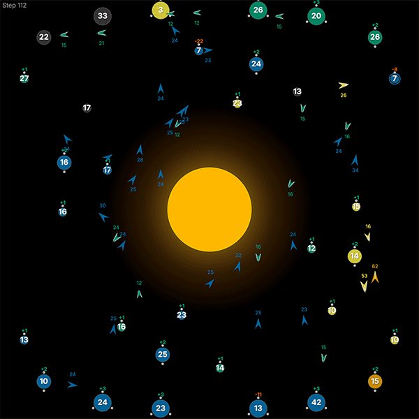

# Orbit Wars Beam Search

A fixed-buffer beam-search agent for Kaggle Orbit Wars.

The repository implements a native C++20 engine exposed to Kaggle through a thin Python entrypoint. The engine converts the continuous game into a ranked set of analytically solved tactical packets, packs those packets into legal multi-order macro-actions under per-source spend constraints, and evaluates them through deterministic rollouts with a fixed-buffer simulator. The Python layer handles Kaggle lifecycle, native import and JIT compilation, and per-player engine caching.

<figure>
  
</figure>

## Overview

Orbit Wars is a real-time strategy game played on a continuous 100 by 100 board with a sun at the center. Players send fleets to capture planets orbiting the sun and comets crossing the board. The game runs for 500 turns, and the winner is the player with the most ships on planets and in fleets. The full rules are documented in [rules/README.md](./rules/README.md).

The agent reasons over a bounded action frontier. Each turn it generates capture, over-capture, harassment, all-safe, and defensive reinforcement packets from every owned source, solves interception geometry for each, packs them into legal macro-actions, and evaluates each macro through a deterministic tactical prefix plus rollout. The evaluator combines material, production, territory, threat, comet value, and a projected-garrison timeline term.

## Key Characteristics

- Native C++20 hot path for geometry, simulation, candidate generation, and search.
- Fixed-capacity `std::array` storage with no dynamic allocation in the hot path.
- Continuous physics with env-faithful swept-pair collision detection.
- Timing-aware capture sizing based on the actual arrival time.
- Defensive reinforcement packets as first-class candidates.
- Root-parallel macro-action evaluation with a preemptible deadline.
- Source-first Kaggle packaging: the submission JIT-compiles the extension at runtime.
- Configuration-driven hyperparameters from `config/hyperparameters.json` with separate 2-player and 4-player champions.

## Repository Layout

```text
.
├── CMakeLists.txt            CMake build definition for the pybind11 extension
├── Makefile                  Convenience targets (build, test, tune, bench, package)
├── pyproject.toml            Tooling configuration (pytest, ruff)
├── requirements-dev.txt      Development dependencies
├── main.py                   Kaggle entrypoint (agent, native import, JIT, champion routing)
├── submission.py             Local alias exposing main.agent
├── config/
│   ├── hyperparameters.json  Single source of truth for tuned parameters and bounds
│   └── league.json           Opponent registry for tuning and benchmarking
├── docs/
│   ├── BENCHMARKING.md       Evaluation protocol, promotion gate, Elo ladder
│   ├── TUNING.md             Tuning system deep dive
│   └── benchmarks/           Benchmark report output directory
├── opponents/                Hand-crafted opponent archetypes
├── rules/
│   ├── README.md             Authoritative competition rules
│   └── AGENTS.md             Getting-started guide
├── scripts/
│   ├── tune.py               Optuna tuning harness (2-player and 4-player)
│   ├── bench.py              Champion benchmark harness
│   ├── diffcheck.py          Differential rules-fidelity check
│   ├── profiling.py          Per-turn latency profiler and perf gate
│   └── package_submission.py Kaggle source bundle builder
├── src/
│   ├── orbit_engine_*.cpp    Native engine implementation files
│   └── include/              Engine headers (constants, board, config, geometry, search)
├── tests/                    pytest suite (bridge, sim, search, packaging, opponents)
└── tuning/                   Reusable tuning package (schema, league, runner, reporting)
```

## Quickstart

### Prerequisites

- Python 3.11 or newer.
- CMake 3.20 or newer.
- A C++20 compiler with Python development headers.
- The packages in `requirements-dev.txt`.

### Set Up the Environment

```bash
python -m venv .venv
source .venv/bin/activate
python -m pip install --upgrade pip
python -m pip install -r requirements-dev.txt
```

### Build

```bash
make build
```

or directly:

```bash
cmake -S . -B build -DCMAKE_BUILD_TYPE=Release
cmake --build build -j
```

### Test

```bash
make test
```

The suite covers geometry, observation parsing, simulator turn order, search legality, packaging, opponent archetypes, and rules fidelity. Run it directly with `PYTHONPATH=build python -m pytest -q tests`.

### Verify Rules Fidelity

```bash
make diffcheck
```

`scripts/diffcheck.py` plays short full games with the native agent and verifies the games complete without invalid or error statuses.

### Run a Minimal Local Call

```bash
PYTHONPATH=build python - <<'PY'
from types import SimpleNamespace
from main import agent

obs = SimpleNamespace(
    player=0, step=0, angular_velocity=0.05,
    planets=[[0, 0, 10.0, 10.0, 2.0, 30, 2], [1, -1, 25.0, 10.0, 2.0, 5, 3]],
    fleets=[],
    initial_planets=[[0, 0, 10.0, 10.0, 2.0, 30, 2], [1, -1, 25.0, 10.0, 2.0, 5, 3]],
    comets=[], comet_planet_ids=[],
)
print(agent(obs))
PY
```

### Tune

```bash
make tune
```

The tuning harness runs separate Optuna studies for 2-player and 4-player play. See [docs/TUNING.md](./docs/TUNING.md) for details.

### Benchmark

```bash
make bench
```

The benchmark harness measures the champion against every league opponent on held-out seeds. See [docs/BENCHMARKING.md](./docs/BENCHMARKING.md) for details.

### Package and Submit

```bash
make package
kaggle competitions submit orbit-wars -f submission.tar.gz -m "orbit-wars-beam-search"
```

`scripts/package_submission.py` writes `submission.tar.gz` containing `main.py`, all C++ sources, the headers under `src/include/`, and vendored pybind11 headers. At runtime `main.py` imports a prebuilt extension if available, otherwise it JIT-compiles the sources.

## Documentation Map

- [ARCHITECTURE.md](./ARCHITECTURE.md): system layers, data flow, search loop, data model, algorithms, and Python API.
- [CONTRIBUTING.md](./CONTRIBUTING.md): development workflow, build and test guidance, code style, and how-to guides.
- [docs/TUNING.md](./docs/TUNING.md): tuning system, schema, Optuna runner, opponent league, and 2-player and 4-player champion routing.
- [docs/BENCHMARKING.md](./docs/BENCHMARKING.md): evaluation protocol, confidence intervals, and the promotion gate.
- [rules/README.md](./rules/README.md): authoritative competition rules and configuration defaults.

## License

This repository is distributed under the Apache License 2.0. See [LICENSE](./LICENSE).
